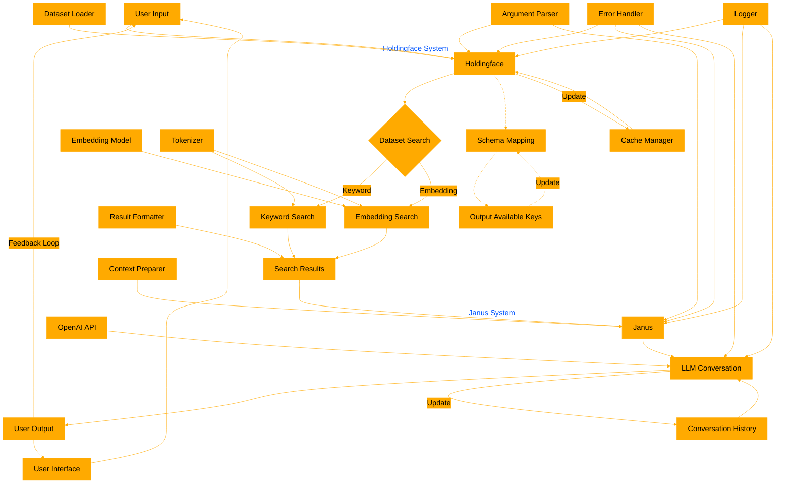

# Holdingface & Janus:
Dataset Search and Chat Tool

## 🌈 README

Holdingface (keyword / embedding search ) and Janus (dataset rag chat) are simple tools for searching Hugging Face datasets and engaging in LLM-powered conversations based on the search results. They also support schema mapping and key discovery for flexible dataset exploration.

### Features:
- 🔍 Search Hugging Face datasets using keywords or embeddings
- 💬 Interactive chat with an LLM using search results as context
- 🎨 Colorful and user-friendly command-line interface
- 🗺️ Schema mapping for flexible dataset exploration
- 🔑 Discover and output available keys in the dataset

### Requirements:
- Python 3.7+
- Required packages: datasets, gpt4all, scipy, tiktoken, tqdm, colorama, pygments, openai

## 📘 User Guide

To use Holdingface and Janus, follow these steps:

1. Install required packages:
   ```
   pip install datasets gpt4all scipy tiktoken tqdm colorama pygments openai
   ```

2. Discover available keys in the dataset:
   ```
   python holdingfaceSEARCH_12.py <dataset_location>
   ```
   This will output the available keys in the dataset without performing a search.

3. Run Holdingface (Dataset Search):
   ```
   python holdingfaceSEARCH_12.py <dataset_location> <query> --search_keys <key1> <key2> --output_keys <key1> <key2> --search_type <embedding/keyword> [--top_k <number>] [--chunk_size <number>] [--max_output_tokens <number>]
   ```

4. Run Janus (Interactive Chat):
   ```
   python janusCHAT_02.py <dataset_location> --search_keys <key1> <key2> --output_keys <key1> <key2> --search_type <embedding/keyword> [--top_k <number>] [--chunk_size <number>] [--max_output_tokens <number>]
   ```

### Schema Mapping and Key Selection

Holdingface allows you to map the Hugging Face dataset to a specific schema by selecting which keys to search and output. This is done using the `--search_keys` and `--output_keys` parameters:

- `--search_keys`: Specify which fields in the dataset to search against
- `--output_keys`: Specify which fields to include in the search results

This flexible mapping allows you to focus on the most relevant parts of the dataset for your specific use case.

### Example Usage:

1. Discover available keys:
   ```
   python holdingfaceSEARCH_12.py username/dataset_name
   ```

2. Search using specific keys:
   ```
   python holdingfaceSEARCH_12.py username/dataset_name "search query" --search_keys title content --output_keys title content url --search_type embedding --top_k 5
   ```

3. Interactive chat using mapped schema:
   ```
   python janusCHAT_02.py username/dataset_name --search_keys title content --output_keys title content url --search_type embedding --top_k 3
   ```





---

## Dataset Search

### Arguments

- `<dataset>`: Hugging Face dataset location (e.g., username/dataset_name)
- `<query>`: Search query
- `--search_keys`: Space-separated list of keys to search against in the dataset
- `--output_keys`: Space-separated list of keys to include in the output
- `--search_type`: Type of search to perform (`embedding` or `keyword`)
- `--top_k`: Number of top results to return (default: 5)
- `--chunk_size`: Chunk size for embedding resolution (default: 100)
- `--max_output_tokens`: Maximum number of tokens for each output field (default: 200)

### Example

```
python dataset_search_tool.py glaiveai/RAG-v1 "What is value .csv table?" --search_keys answer question --output_keys question answer documents --search_type embedding --top_k 1 --chunk_size 2000 --max_output_tokens 100
```

## Output

The tool will display:
- Search parameters
- Progress of dataset loading and embedding (if applicable)
- Top results, including:
  - Combined relevance score
  - Full schema of the result (colorized JSON)
  - Formatted output with specified keys (truncated and syntax-highlighted)

## Multi-field Search

When searching across multiple fields:
- For embedding-based search, the tool combines embeddings from all specified fields and calculates a weighted average of cosine similarities.
- For keyword-based search, the tool performs individual searches on each field and combines the results, sorting by relevance.

Currently, equal weights are used for multiple fields. Future versions may allow custom weight specification.

## Caching

The tool caches datasets and embeddings to improve performance for subsequent searches. Cached files are stored in the same directory as the script.

## Note

This tool requires an internet connection to download datasets from Hugging Face. Ensure you have sufficient disk space for caching large datasets and their embeddings. It transforms the files, so not intended as a 1 to 1 backuptool for your hf datasets. 
